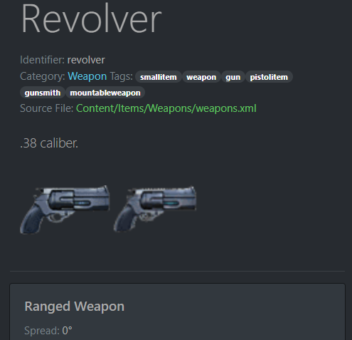

# I like making things

Here's a few of them

### Cell - Falling Sand Physics Game (Source Unavailible)

    
    

 - University Final Year Project
 - Custom C++ game engine (GLFW/ImGui/OpenGL)
 - 2D sand particle physics simulation

### [Barodocs](https://barodocs.ddns.net) - Game wiki React SPA ([Source](https://github.com/underscoren/barodocs))

    
    

 - React Single Page Application (SPA)
 - Reverse engineered game data
 - Pages generated on-device from scraped game files

Currently attending Game Dev Bootcamp to upskill in Unity and programming, and find employment.

## Stats

